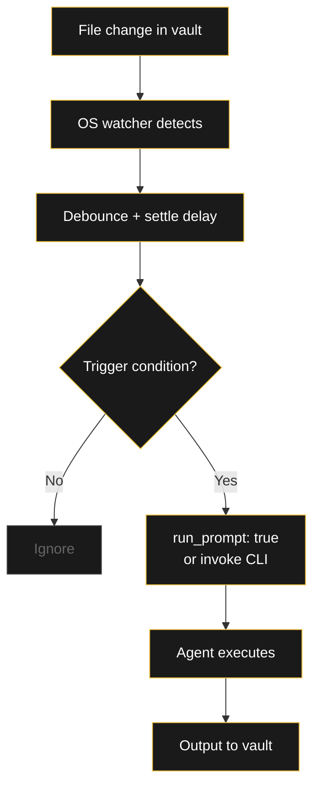

###### Related: [[Projekte/index]] | [[Projekte/Prompt Shop|Prompt Shop]] | [[Einführung]]

---

# AI Ecosystem — What I've Built

> A living catalog of everything inside `03_INFORMATIONEN/00_AI` — prompts, agents, hooks, workflows, rules, tools, and research. 130+ files across 17 folders, built over months of daily use.

This is not a portfolio. This is the actual system I use every day: a structured AI layer over my Obsidian vault that automates German learning, job applications, knowledge management, and personal tracking. Every component was built because I needed it, and refined because I used it.

---

## Contents

| Section | Count | Description |
|---------|-------|-------------|
| [1. Prompts](#1-prompts-01_prompts) | 44 | Structured AI directives for specific tasks |
| [2. Agents](#2-agents-04_agents) | 12 | Autonomous AI agents with defined roles |
| [3. Hooks](#3-hooks-02_hooks) | 5 | Automation triggers wired into the vault |
| [4. Scheduled Tasks](#4-scheduled-tasks-03_schedule) | 4 | Cron-driven AI processes |
| [5. Workflows](#5-workflows-13_workflows) | 5 | Documented multi-step procedures |
| [6. Rules](#6-rules-07_rules) | 4 | Behavioral constraints for AI operations |
| [7. Semantic Web](/Semantic-Web) | 17 | Ontology research for TIB Data Architect — published as full guides |
| [8. Tools](#8-tools-14_tools) | 2 | Custom-built utilities |
| [9. Troubleshooting](#9-troubleshooting-06_troubleshooting) | 6 | Bug reports and resolution logs |
| [10. Reference](#10-reference-05_information) | 9 | Architecture notes and comparisons |
| [11. Sessions](#11-sessions-10_sessions) | 3 | Claude conversation archives |
| [12. Model Pricing](#12-model-pricing--comparison-aug-2026) | 1 | LLM API pricing reference, updated monthly |
| **Total** | **130+** | |

---

## 1. Prompts (`01_PROMPTS`)

44 structured AI prompts organized by domain. Each one follows the RA framework: INTENT, CONTEXT, CONSTRAINTS, OUTPUT, PREFERENCES. Most are available in the [Prompt Shop](/Projekte/Prompt-Shop).

### 🇩🇪 German Learning (12)

| Prompt | Purpose |
|--------|---------|
| **Deutsche Konzept** | Full grammar concept explanations at A2–B1 |
| **Deutsche Wörte** | Complete vocabulary cards with conjugations |
| **Deutsche Wortliste** | Bulk card creation from paragraph scan |
| **Deutsche Übungen Foto** | Photo → solved grammar exercises |
| **Deutsche Übungen Text** | Text → solved grammar exercises |
| **Book Activity to Markdown** | Textbook page → structured note |
| **Deutsch Unterricht** | VHS/BSI class note assistant |
| **A2.2 Zusammenfassung** | Course synthesis into master reference |
| **DTZ B1 Anki Cards** | DTZ exam flashcards |
| **VHS Phrase Explainer** | Phrase breakdown with grammar context |
| **VHS Class Anki Cards** | Class → Anki cards in Obsidian syntax |
| **Neue Sätze Übersetzer** | Incremental sentence annotation |

### 💼 Job Hunting (6)

| Prompt | Purpose |
|--------|---------|
| **Postulation & Company** | Company research + postulation note |
| **G2 Engineering Recruiter** | Recruiter outreach reply |
| **Cover Letter Database** | Cover letter prompt management |
| **Cover Letter Writer** | Formal cover letter generation |
| **Email Follow-up** | German Amtssprache follow-ups |
| **Agency Job Search Filter** | Agency-based search filtering |

### 🗂️ Obsidian / PKM (7)

| Prompt | Purpose |
|--------|---------|
| **Prompt Construction** | New prompt design within RA framework |
| **Obsidian Notes** | Full structured notes from any topic |
| **Image to Text** | Document photo → Markdown |
| **Text Format Change** | Plain text → Obsidian Markdown |
| **What It Is and How to Apply** | Concept reference notes |
| **Document Translation** | Multi-language document translation |
| **Database** | Prompt index and catalog |

### ⚙️ Automation (6)

| Prompt | Purpose |
|--------|---------|
| **Schedule Task** | Autonomous task template |
| **Hook Creation** | Hook JSON generator |
| **Session Review** | Post-session analysis |
| **Troubleshooting Plan** | Diagnostic procedure builder |
| **ActivityWatch** | PC usage data → daily note |
| **Webpage Obsidian Update** | Blog sync status → vault note |

### 🧠 Personal (6)

| Prompt | Purpose |
|--------|---------|
| **Daily Note** | Reflective Tageszusammenfassung |
| **Dream Interpretation** | Multi-framework dream analysis |
| **Monthly Life Report** | Month metrics with ASCII charts |
| **Personal Finances** | Cash flow and expense tracking |
| **Study Schedule** | Calendar event generator |
| **Person Note** | Individual profile note creator |

### 🛠️ Specialized (7)

| Prompt | Purpose |
|--------|---------|
| **Agent Creation** | New AI agent specification |
| **Claude Session Log** | Conversation log processing |
| **Profession Title Analysis** | Role-to-skills mapping |
| **WhatsApp Chat Export** | Chat export → structured notes |
| **Traum (original)** | Dream journal entry |
| **Traum 1** | Alternative dream format |
| **Spotify Daily Note Integration** | Music → daily context |
| **Create Dexter Sub-Agent** | Dexter child agent factory |

---

## 2. Agents (`04_AGENTS`)

12 autonomous agents with defined personalities, workflows, and vault integrations.

| Agent | Role | Status |
|-------|------|--------|
| **Dexter** | Task decomposition — takes one SCH item and breaks it into actionable subtasks with ABC triage | 🟢 active |
| **Wörter-Scout** | German vocabulary card automation — fills empty stubs with full lexical data | 🟢 active |
| **Wörter-Scout OpenCode** | Alternative implementation via OpenCode CLI | ⏸️ paused |
| **Neue Sätze Übersetzer** | Incremental German sentence annotation with wikilinks | 🟢 active |
| **RA Mirror** | Daily vault mirror — reads daily note and writes a brief Ra commentary | 🟢 active |
| **RA Blog Manager** | Publishes content to ra-blog via Quartz, generates distribution kits | 🟢 active |
| **Klodi** | VHS class note → Anki cards (8-ticket pipeline) | 🟢 active |
| **Lebens-Coach** | Life coaching agent — SCH task prioritization | 🟢 active |
| **Calendario Solar** | Calendar event routing and categorization | 🟢 active |
| **VHS Phrase Explainer** | German phrase breakdown from VHS callouts | 🟢 active |
| **Cover Letter Reviewer** | Cover letter quality check and feedback | 🟢 active |
| **Obsidian Deutsche Wörte** | Vocabulary card formatting agent | 🟢 active |

Also includes the **Agents Database** (master index) and **Improvement Plan** (development roadmap).

---

## 3. Hooks (`02_HOOKS`)

5 automation triggers that connect vault events to AI actions. This is the reactive layer — the vault's nervous system.



### Active Hooks

| Hook | Trigger | Action |
|------|---------|--------|
| **Prompt Runner Watcher** | File change with `run_prompt: true` | Reads `run_prompt: true` → executes prompt |
| **Vault Root File Watcher** | New file in vault root | Routes file to correct folder |
| **Daily Note Trigger** | New daily note created | Executes daily AI routine |
| **Neue Sätze Watcher** | New sentence added | Triggers Übersetzer agent |
| **Deutsche Wörter Stammverzeichnis** | Vocabulary note created | Registers word in master index |

### Hook vs. Agent

| Characteristic | Hook | Agent |
|----------------|------|-------|
| **Nature** | Static, deterministic | Dynamic, cognitive |
| **Initiative** | Reactive — waits for event | Proactive — decides how/when |
| **Workflow** | Linear (if A → B) | Non-linear (can pivot, retry) |
| **Resource cost** | Low | High (tokens per decision) |

### File Watcher Pattern

All filesystem hooks use the same infrastructure: Python `watchdog` with `PollingObserver`, 30s debounce per file, 2s settle delay for Obsidian's atomic saves, and a `state.json` keyed by modification time. The system follows a three-layer separation: **Watcher** (senses) → **Trigger** (decides) → **Executor** (acts). This makes debugging trivial — if a prompt didn't run, check which layer failed.

> [!note] RA
> Hooks are the nervous system (senses). Agents are the brain (decisions). Neither works alone.

---

## 4. Scheduled Tasks (`03_SCHEDULE`)

4 cron-driven AI processes that run on schedule without manual input.

| Task | Schedule | What it does |
|------|----------|-------------|
| **Daily Note** | Every day at set time | Generates Tageszusammenfassung |
| **Receipts to Text** | On receipt photo | OCR and expense categorization |
| **Schedule Prompt Design** | Template | Creates new schedule manifests |
| **Schedule Database** | Index | Master schedule registry |

---

## 5. Workflows (`13_WORKFLOWS`)

5 documented multi-step procedures for running the AI ecosystem.

| Workflow | What it covers |
|----------|----------------|
| **Wörter-Scout** | End-to-end vocabulary card pipeline |
| **Prompt Runner** | Prompt execution lifecycle |
| **Daily Note Trigger** | Daily automation flow |
| **OpenCode DeepSeek Hybrid** | Multi-agent coding setup |
| **Workflow Update Template** | Standard procedure for updating workflows |

Also includes the **AI Workflows Database** (master index of all workflows).

---

## 6. Rules (`07_RULES`)

4 behavioral constraint documents that define how AI agents operate in the vault.

| Rule | Scope |
|------|-------|
| **PROMPT RUNNER** | Execution protocol for the prompt runner system |
| **DAILY NOTE CONTENT ROUTING** | What goes in daily notes vs. dedicated notes |
| **SCHEDULED TASKS** | Cron job design conventions |
| **WIKILINKS A2 DEUTSCH** | Wiki link conventions for German vocabulary |

---

## 7. Semantic Web (`11_SEMANTIC_WEB`)

17 research notes built while preparing for the **TIB Semantic Data Architect** position — from RDF to OWL to Knowledge Graphs.

| Key Notes | Topic |
|-----------|-------|
| **Semantic Data Architect** | Core role analysis |
| **RDF** | Resource Description Framework |
| **SPARQL** | Query language for RDF |
| **OWL** | Web Ontology Language |
| **Knowledge Graphs** | Architecture and design |
| **GraphDB / Neo4j** | Graph database comparison |
| **Ontology Engineering** | Ontology development methodology |
| **Linked Data** | Interconnected data principles |
| **TOGAF** | Enterprise architecture framework |
| **TIB - Analysis & Roadmap** | Full application strategy |
| **TIB - 2-Hour Quick Wins** | Immediate preparation tactics |
| **TIB - Vault Strategy Analysis** | Vault → portfolio transformation |
| **Vault Semantic Showcase** | Presenting the vault as a semantic demo |
| **YellowVault Knowledge Graph Ontology** | Custom vault ontology |
| **Data Governance / Metadata / ETL / Data Modeling / Data Cataloging** | Supporting reference notes |

---

## 8. Tools (`14_TOOLS`)

Custom-built utilities designed and documented in the vault.

| Tool | What it does |
|------|-------------|
| **RA Log Viewer** | Browser-based viewer for Hermes agent log files — real-time memory/CPU monitoring |

---

## 9. Troubleshooting (`06_TROUBLESHOOTING`)

6 documented bug hunts and their resolutions — a living record of what broke and how it was fixed.

| Bug | Date | Resolution |
|-----|------|------------|
| Wörter-Scout Watcher Bugs | 2026-06-18 | Fixed false positives and stuck stubs |
| Wörter-Scout False Positives | 2026-06-18 | Refined stub detection logic |
| Daily Note Trigger Not Firing | 2026-06-16 | Hook timing issue resolved |
| Prompt Runner Hook No Auto-Execute | 2026-06-16 | Watcher race condition fixed |
| Prompt Runner Checkbox Issue | 2026-06-14 | `run_prompt` parsing corrected |
| German Word Watcher Not Filling Cards | 2026-06-10 | Watcher → filler pipeline fixed |

---

## 10. Reference (`05_INFORMATION`)

9 architecture and comparison notes that document the design decisions behind the system.

| Note | Content |
|------|---------|
| **Prompt Database — How it Works** | RA framework architecture |
| **Agents and Hooks** | Agent-hook relationship model |
| **AI Agent Leverage** | ROI analysis of each agent |
| **IA Models - Comparison** | Model capability matrix |
| **API Credit Burn Rate** | Cost tracking projections |
| **Dexter ABC Task Questions** | ABC triage question bank |
| **Claude Code Window Views** | VS Code / Obsidian integration |
| **Codex - OpenAI Coding Agent** | Alternative agent research |
| **AI - Prompt Chaining** | Multi-prompt pipeline design patterns |
| **ChatGPT Prompts** | General-purpose prompt collection |

---

> [!tip] In-page references
> The Hook System and File Watcher Pattern are documented in context above — see [§3 Hooks](#3-hooks-02_hooks) and the **File Watcher Pattern** subsection under hooks.

---

## 11. Sessions (`10_SESSIONS`)

3 archived Claude conversations — preserved as structured notes for reference and reuse.

| Session | Date | Content |
|---------|------|---------|
| 16.06.26 | June 16 | Claude session log |
| 17.06.26 | June 17 | Claude session log |
| 18.06.26 | June 18 | Claude session log |

---

## 12. Model Pricing & Comparison (Aug 2026)

How I pick models: a budget-first pricing reference for LLM APIs, updated monthly. The rule of thumb — if a flash-tier model can do the job, never pay for a premium one.

### Pricing essentials

| Model | Input | Output | Ctx | Vision | Notes |
|---|---|---|---|---|---|
| **Qwen 3.7 Flash** | $0.03 | $0.13 | 1M | ✅ | Ultra-cheap, vision |
| **DeepSeek V4 Flash 0731** | $0.09 | $0.18 | 1M | ❌ | Default for text agents |
| **Gemini 2.5 Flash Lite** | $0.10 | $0.40 | 1M | ✅ | Reliable vision |
| **GPT-5.6 Luna** | $0.10 | $0.60 | 1M | ✅ | Dropped 80%, competes on budget |
| Mistral Small 3.2 | $0.08 | $0.20 | 256K | ✅ | Limited context |
| **DeepSeek V4 Pro** | $0.435 | $0.87 | 1M | ❌ | Best mid-tier value |
| DeepSeek R1 0528 | $0.50 | $2.15 | 164K | ❌ | Reasoning, expensive output |
| **GPT-5.6 Terra** | $1.00 | $6.00 | 1M | ✅ | Mid-tier OpenAI |
| Claude Sonnet 5 | $2.00 | $10.00 | 1M | ✅ | ⚠️ Intro price until Aug 31 |
| **Claude Opus 5** | $5.00 | $25.00 | 1M | ✅ | New generation |
| GPT-5.6 Sol | $5.00 | $30.00 | 1M | ✅ | Doubled in Aug |
| Claude Fable 5 | $10.00 | $50.00 | 1M | ✅ | Extreme cases only |

> ⚠️ **Sonnet 5 intro pricing ($2/$10) expires Aug 31.** After that it goes to regular (~$3/$15 — verify on OpenRouter). Re-evaluate anything depending on Sonnet 5 before Sep 1.

### OpenRouter leaderboard (Aug 2026)

| # | Model | Tokens |
|---|---|---|
| 🥇 | DeepSeek V4 Flash | 6.10T |
| 🥈 | Owl Alpha | 3.92T |
| 🥉 | Hy3 (Tencent) | 3.80T |
| 4 | MiniMax M3 | 3.20T |
| 5 | Step 3.7 Flash | 2.91T |
| 6 | DeepSeek V4 Pro | 2.45T |
| 7 | GLM 5.2 | 2.10T |
| 8 | Qwen 3.7 Flash | 1.85T |
| 9 | Nemotron 3 Ultra | 1.72T |
| 10 | Claude Opus 5 | 0.92T |

DeepSeek alone accounts for 8.55T tokens — more than triple any other single provider.

### Cost optimization strategies

1. **Cache hits** — DeepSeek cache hits cost **$0.003/1M tokens** (97% off list price). Repetitive agent prompts benefit massively.
2. **Prompt caching setup** — identical system-prompt prefixes across calls; keep the same prefix per request; cache TTL ~5–10 min on DeepSeek.
3. **Tier discipline** — flash for 80% of tasks, mid-tier only for multi-step reasoning, premium only for writing quality that visibly matters.
4. **Never** use Sonnet/Opus for tasks a flash model can do. **Always** try V4 Pro before upgrading to Sonnet 5.

### Quick reference card

```
╔══════════════════════════════════════════════╗
║  USE THIS           FOR THIS                 ║
╠══════════════════════════════════════════════╣
║  V4 Flash 0731      80% of everything        ║
║  V4 Pro             Multi-step reasoning     ║
║  Gemini Flash Lite  Photos, OCR, Telegram    ║
║  Qwen 3.7 Flash     Ultra-cheap vision       ║
║  Sonnet 5           Letters, fine prose      ║
║  R1 0528            Pure reasoning           ║
║  GPT-5.6 Luna       Budget-alt vision        ║
╚══════════════════════════════════════════════╝
```

> 💡 **Golden rule:** if V4 Flash can do it, don't use anything more expensive. Scale to V4 Pro only for multi-step reasoning. Scale to Sonnet 5 only when writing quality is critical.

---

## 13. Ecosystem One-Pager (Aug. 2026)

> Das ganze Ökosystem in einer Ansicht: 4.063 Notizen → dualer Watchdog + 30-Minuten-Orchestrator → zwei parallele Gehirne (GraphDB 51.811 Triples + ChromaDB 14.180 Chunks) → drei Agenten → Prompt Runner → Visualisierung und Betrieb. 16 Knoten, ohne toten Raum, alles lokal oder Docker on-demand.

<iframe src="/static/mental-maps/ecosystem-one-pager.html" style="width:100%;height:720px;border:1px solid #3a3a3a;border-radius:8px;background:#000" title="AI-Ökosystem One-Pager"></iframe>

Die wichtigsten Zahlen hinter dem Diagramm:

| Ebene | Komponenten | Live-Kennzahlen |
|-------|-------------|-----------------|
| 📁 Quelle | Obsidian-Vault, `run_prompt: true` | 4.063 Notizen |
| ⚙️ Automatisierung | `vault_structure_sync.py` alle 30 Min., NER, RDF-Parse, Embeddings | 6.210 Mentions · 74 Entitäten |
| 🗄️ Zwei Gehirne | GraphDB (Triples) + ChromaDB (Chunks) | 51.811 Triples · 14.180 Chunks · 5.810 Dateien |
| 🔌 Zugriff | `sparql_bridge`, `hybrid_context`, `qa_kg` | Prompt Runner v3.17 |
| 👁️ Visualisierung & Monitoring | WebVOWL · Grafana · RA Log Viewer | 5 SPARQL-Panels · 30s Refresh |
| 🛡️ Betrieb | Backup · Health · Keep-alive · Auto-Start | Backup So 4 Uhr · 35K-Schwelle |

> [!note] RA
> Jedes System, das ich gebaut habe, ist ein Spiegel einer Lücke, die ich gefunden habe — nicht in den Tools, sondern darin, wie ich sie benutzt habe.

---

### Other Folders

| Folder | Content |
|--------|---------|
| `02_LEARNING` | Personal AI learning notes (May 2026) |
| `08_TOKENS` | API token management |
| `09_API` | API configuration (Spotify, etc.) |
| `10_SESSIONS` | Archived conversations |
| `12_PROJECTS` | Project-specific files |

---

> [!note] RA
> Every system I've built is a mirror of a gap I found — not in the tools, but in how I was using them.

*Built something similar? I'd love to hear how you structure your AI ecosystem. → [raul.mina1@outlook.com](mailto:raul.mina1@outlook.com)*
