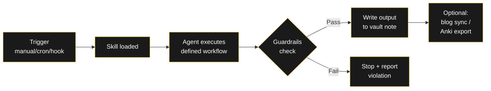
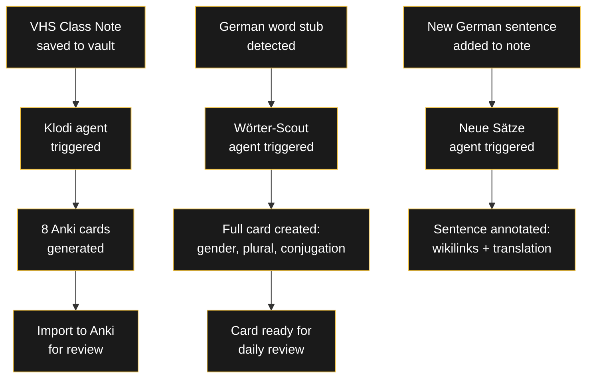
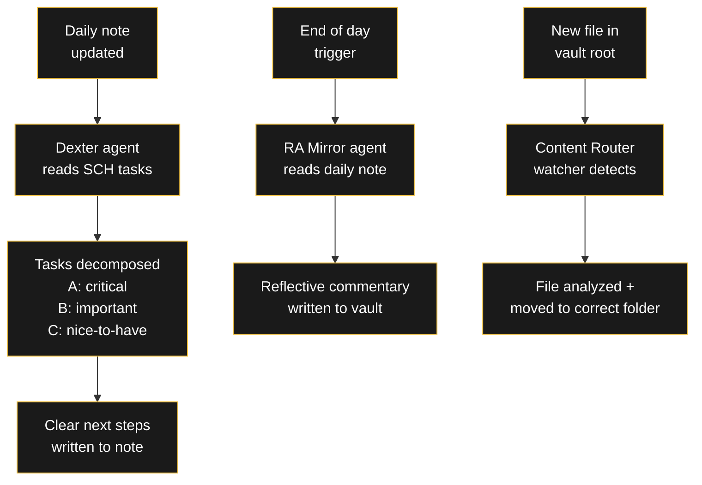

###### Related: [[Projekte/Prompt Shop|Prompt Shop]] | [[Projekte/Cron Shop|Cron Shop]] | [[Projekte/Hook Shop|Hook Shop]]

---

# RA Agent Shop

> Autonomous AI agents that live in your vault and do work without supervision. Each agent is a complete specification: Hermes skill file, vault note, workflow documentation, and guardrails.

An agent is not a prompt. A prompt tells the AI what to do once. An agent has a **role**, a **personality**, a **workflow**, and **memory** — it works continuously, maintains context across sessions, and follows guardrails automatically.

---

## How an agent works

---

## Packs & Pricing

| Pack | Agents included | Price |
|------|----------------|-------|
| 🇩🇪 German Learning Agent Pack | 3 agents | €60 |
| 🗂️ Vault Automation Pack | 3 agents | €60 |
| 🔧 Custom Agent (your spec) | 1 bespoke agent | €40 |
| 📦 Complete Agent Bundle — All 6 | 6 agents | ~~€120~~ **€100** · ★ Recommended |

To order: **raul.mina1@outlook.com** — include which pack(s) you want.

---

## 🇩🇪 German Learning Agent Pack — €60

3 agents that automate your German study pipeline — from class notes to Anki cards to sentence annotation.

| Agent | What it does | Real-world impact |
|-------|-------------|-------------------|
| **Wörter-Scout** | Watches your vault for empty German vocabulary stubs, fills them with full lexical data (gender, plural, conjugations, examples). | ~734 cards generated automatically. No more manual card creation. |
| **Klodi** | Reads a VHS class note and generates 8 Anki cards per session: vocabulary, grammar rules, Redemittel, and exam tips. | One command → full deck ready for import. |
| **Neue Sätze Übersetzer** | Incrementally annotates collected German sentences with wikilinks, translations, and grammar breakdowns. | Processes one sentence at a time, never overwhelming you. |

### Flowchart: German Learning Pipeline

---

## 🗂️ Vault Automation Pack — €60

3 agents that keep your vault organized and your tasks moving — no manual triage needed.

| Agent | What it does | Real-world impact |
|-------|-------------|-------------------|
| **Dexter** | Takes any scheduled task from your daily note and decomposes it into actionable subtasks with ABC priority triage. | One task → clear next steps. No more staring at a vague todo. |
| **RA Mirror** | Reads your daily note at end of day and writes a reflective commentary — a second perspective on what happened. | Daily introspection without the mental effort of writing it yourself. |
| **Content Router** | Watches for new files in the vault root and automatically moves them to the correct folder based on content analysis. | Zero inbox. Every note lands where it belongs. |

### Flowchart: Vault Automation Pipeline

---

## 🔧 Custom Agent — €40

You describe the task. I build the agent.

**What you get:**
- Hermes skill file (SKILL.md) with full workflow
- Vault specification note
- Guardrails and privacy rules
- Tested against your vault structure
- Documentation for triggering (manual, cron, or hook)

**Examples of custom agents:**
- A weekly newsletter compiler from your reading notes
- A job-matching agent that scores new postings against your CV
- A habit tracker that analyzes daily note entries and generates monthly reports

---

## 📦 Complete Agent Bundle — All 6 agents — €100

Everything in both packs at a discount. Save €20 vs. buying separately.

---

## Order

1. Fill the form below with your email and which agent(s) you want
2. You'll pay via PayPal (raulmina1@outlook.com)
3. After payment, you'll receive the agent skill files + setup within 48 hours

**[Request Form →](mailto:raul.mina1@outlook.com?subject=Agent%20Pack%20Order&body=Email:%0A%0AAgents%20wanted:%0A%0AMessage:)** *Click to send me an email. Include your email, which agents you want, and a description if ordering Custom.*

> [!warning] Requirements
> You need **Hermes Agent** (or compatible MCP client) to run these agents. No coding required — just drop the skills into your Hermes folder.

---

> [!note] RA
> Every agent is a task you no longer have to think about. That silence is the actual product.

*Which task would you most like to automate? I'm curious what you're building. → [raul.mina1@outlook.com](mailto:raul.mina1@outlook.com)*
