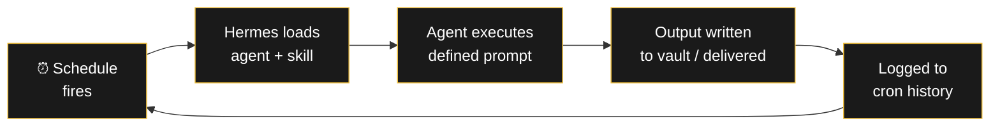
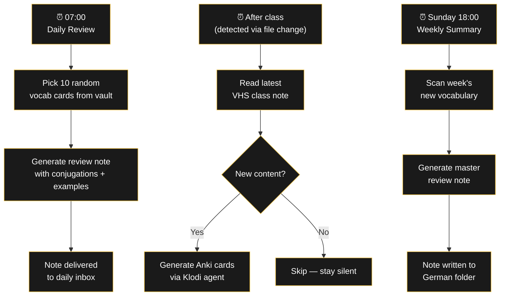
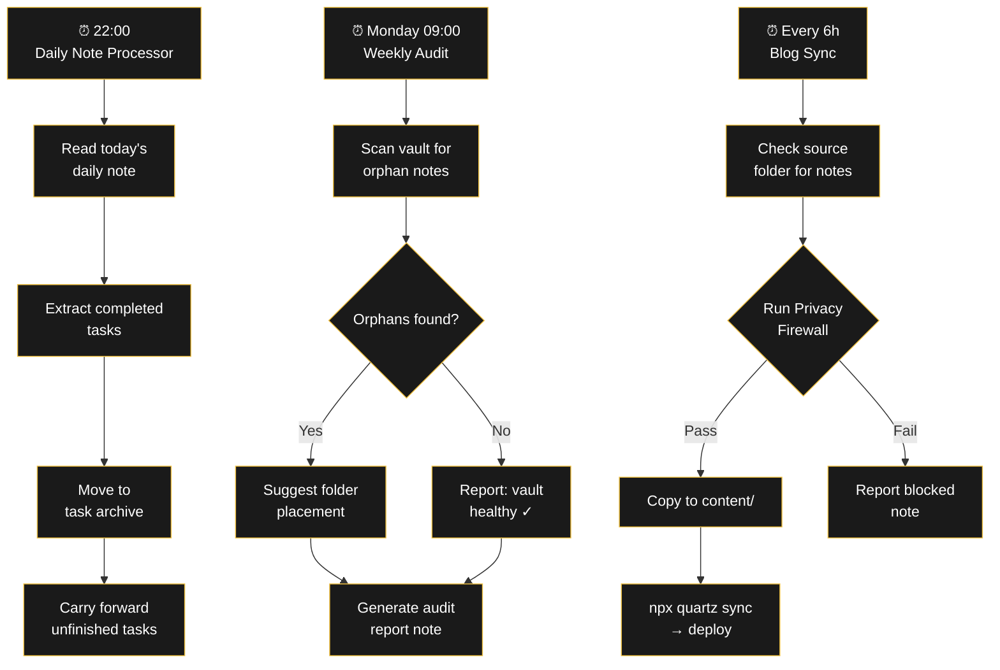

###### Related: [[Projekte/Prompt Shop|Prompt Shop]] | [[Projekte/Agent Shop|Agent Shop]] | [[Projekte/Hook Shop|Hook Shop]]

---

# RA Cron Shop

> Scheduled AI automations that run without you. A cron is a prompt + agent + schedule bundled into one package — fire and forget.

Unlike a prompt (one-time) or an agent (on-demand), a cron runs **automatically at set intervals**. You never have to remember to run it. It just works.

---

## How a cron works

---

## Packs & Pricing

| Pack | Crons included | Price |
|------|----------------|-------|
| 🇩🇪 Daily German Routine | 3 crons | €35 |
| 🗂️ Vault Maintenance Pack | 3 crons | €35 |
| 🔧 Custom Cron (your spec) | 1 bespoke schedule | €20 |
| 📦 Complete Cron Bundle — All 6 | 6 crons | **€55** |

To order: **raul.mina1@outlook.com** — include which pack(s) you want.

---

## 🇩🇪 Daily German Routine — €35

3 crons that keep your German practice going every day without lifting a finger.

| Cron | Schedule | What it does |
|------|----------|-------------|
| **Daily Vocabulary Review** | Every morning | Picks 10 random vocabulary cards from your vault and generates a formatted review note with conjugations, example sentences, and gender reminders. |
| **VHS Class Processing** | After class | Reads the latest class note and triggers Klodi to generate Anki cards. If no new class note, stays silent. |
| **Weekly Summary** | Every Sunday | Synthesizes the week's new vocabulary, grammar concepts, and mistakes into one master review note. |

### Flowchart: Daily German Routine

---

## 🗂️ Vault Maintenance Pack — €35

3 crons that keep your vault clean, backed up, and growing.

| Cron | Schedule | What it does |
|------|----------|-------------|
| **Daily Note Processor** | Every evening | Reads the day's daily note, extracts completed tasks, moves them to the task archive, and appends unfinished tasks to tomorrow's note. |
| **Weekly Vault Audit** | Every Monday | Scans the vault for orphan notes (no wikilinks pointing to them), suggests folders for unclassified notes, and reports vault health metrics. |
| **Blog Sync** | Every 6 hours | Checks the blog source folder for new publishable notes, runs Privacy Firewall, copies approved notes to Quartz `content/`, and runs `quartz sync`. |

### Flowchart: Vault Maintenance Pipeline

---

## 🔧 Custom Cron — €20

Describe the schedule and the task. I build the cron.

**What you get:**
- Cron manifest with exact schedule
- Prompt + skill configuration
- Hermes cron job definition
- Delivery configuration (vault, email, or message)
- Tested end-to-end

**Examples:**
- Nightly backup status report
- Weekly AI art prompt delivery
- Monthly expense report generator
- Daily quote or word-of-the-day
- Periodic market/price checker

---

## 📦 Complete Cron Bundle — All 6 crons — €55

Everything in both packs at a discount. Save €15 vs. buying separately.

---

## Order

1. Fill the form below with your email and which cron(s) you want
2. You'll pay via PayPal (raulmina1@outlook.com)
3. After payment, you'll receive the cron manifests + setup within 24 hours

**[Request Form →](mailto:raul.mina1@outlook.com?subject=Cron%20Pack%20Order&body=Email:%0A%0ACrons%20wanted:%0A%0AMessage:)** *Click to send me an email. Include your email, which crons you want, and the schedule for Custom orders.*

> [!warning] Requirements
> You need **Hermes Agent** (or compatible cron system) to run these schedules. No coding required — just import the JSON definitions.

---

> [!note] RA
> The best automation is the one you forget exists because it always just works.

*What schedule would make your life easier if it just ran by itself? → [raul.mina1@outlook.com](mailto:raul.mina1@outlook.com)*
