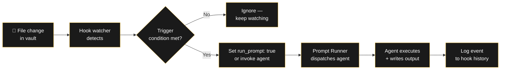
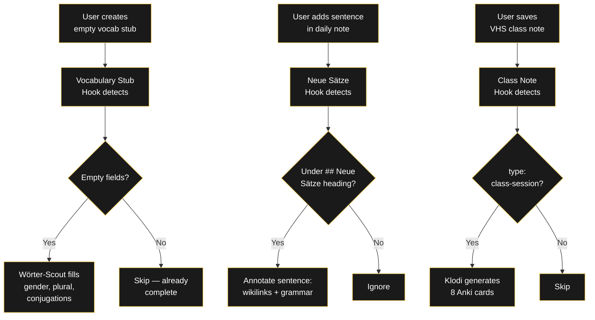
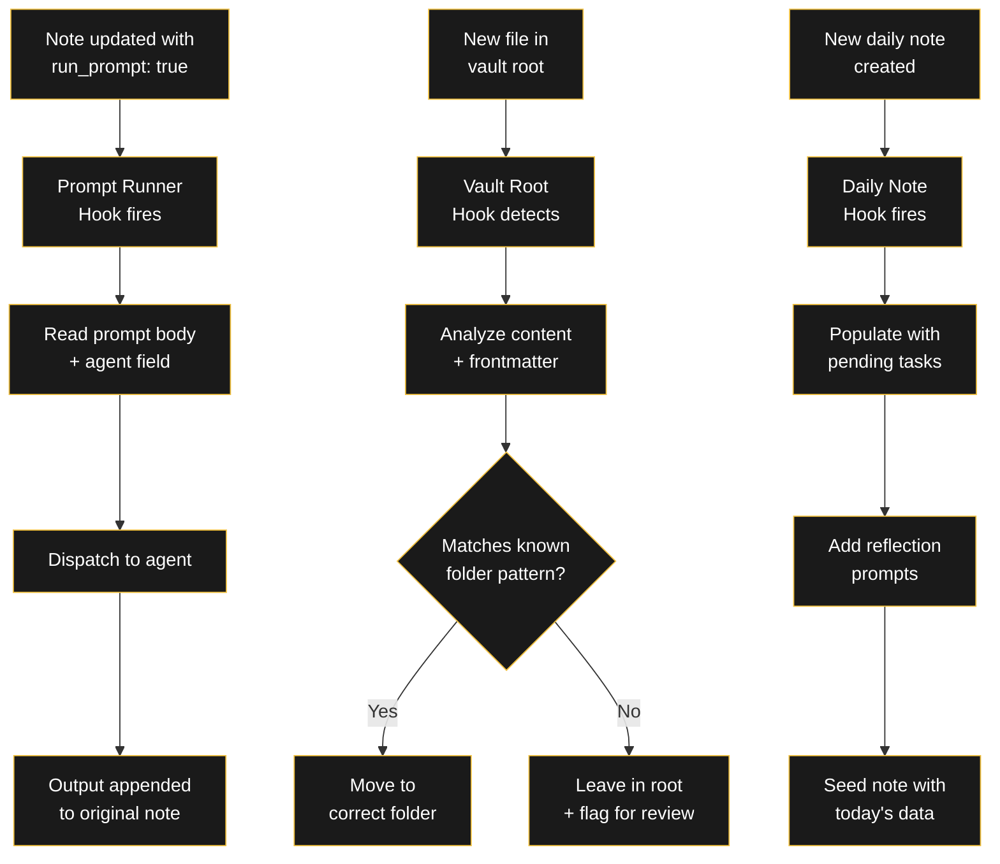

###### Related: [[Projekte/Prompt Shop|Prompt Shop]] | [[Projekte/Agent Shop|Agent Shop]] | [[Projekte/Cron Shop|Cron Shop]]

---

# RA Hook Shop

> Event-driven automation that reacts to your vault in real time. A hook watches a file path, detects changes, and dispatches an agent — all automatically.

A cron runs on a schedule. A hook runs on **events** — file saves, new notes, specific frontmatter changes. Together they form the reactive layer: the vault responds to itself.

---

## How a hook works

---

## Packs & Pricing

| Pack | Hooks included | Price |
|------|----------------|-------|
| 🇩🇪 German Learning Hooks | 3 hooks | €45 |
| ⚡ Vault Automation Hooks | 3 hooks | €45 |
| 🔧 Custom Hook (your spec) | 1 bespoke trigger | €30 |
| 📦 Complete Hook Bundle — All 6 | 6 hooks | ~~€90~~ **€75** · ★ Recommended |

To order: **raul.mina1@outlook.com** — include which pack(s) you want.

---

## 🇩🇪 German Learning Hooks — €45

3 hooks that react the moment you create German learning content — no manual triggering needed.

| Hook | Trigger | Action |
|------|---------|--------|
| **Vocabulary Stub Detector** | A new note with `type: german-word` and empty `konjugation:` field is created | Fires Wörter-Scout agent to fill the card with full lexical data (gender, plural, conjugations, 3 examples). |
| **Neue Sätze Watcher** | A new sentence is added under a `## Neue Sätze` heading in a daily note | Triggers the Neue Sätze agent to annotate the sentence with wikilinks, grammar breakdown, and Spanish translation. |
| **Class Note Trigger** | A note is saved in the VHS class note folder with `type: class-session` | Fires Klodi agent to extract all new vocabulary and generate 8 Anki cards. |

### Flowchart: German Learning Hooks

---

## ⚡ Vault Automation Hooks — €45

3 hooks that keep your vault organized without you thinking about it.

| Hook | Trigger | Action |
|------|---------|--------|
| **Prompt Runner Watcher** | Any note gets `run_prompt: true` in frontmatter | Reads the prompt body, dispatches to configured agent/engine, appends output to the note. This is the core execution engine. |
| **Vault Root Router** | A new file appears in the vault root | Analyzes content and frontmatter, moves the file to the correct folder, logs the move in a routing history note. |
| **Daily Note Trigger** | A new daily note is created with today's date | Fires the daily note processor: populates the note with pending tasks from the task index, adds a weather/date header, and seeds reflection prompts. |

### Flowchart: Vault Automation Hooks

---

## 🔧 Custom Hook — €30

Describe the trigger and the action. I build the hook.

**What you get:**
- Python watcher script (Hermes-compatible)
- Trigger condition logic
- Action configuration (which agent or prompt to fire)
- Hook manifest for deployment
- Tested against your vault structure

**Examples:**
- A hook that detects new job postings and fires the job research agent
- A hook that watches a shared folder and routes incoming files to the right project
- A hook that detects specific frontmatter tags and writes summary cards

---

## 📦 Complete Hook Bundle — All 6 hooks — €75

Everything in both packs at a discount. Save €15 vs. buying separately.

> **Tip:** Hooks and crons work together. A cron schedules the check; a hook reacts instantly. For time-sensitive automations (like Anki card generation after a class note), hooks are essential. For daily routines (like morning vocabulary review), crons are sufficient.

---

## Order

1. Fill the form below with your email and which hook(s) you want
2. You'll pay via PayPal (raulmina1@outlook.com)
3. After payment, you'll receive the hook definitions + scripts within 48 hours

**[Request Form →](mailto:raul.mina1@outlook.com?subject=Hook%20Pack%20Order&body=Email:%0A%0AHooks%20wanted:%0A%0AMessage:)** *Click to send me an email. Include your email, which hooks you want, and the trigger+action for Custom orders.*

> [!warning] Requirements
> You need **Hermes Agent** (or compatible watcher system) to run these hooks. No coding required.

---

> [!note] RA
> A hook is not automation. It just tells the vault it's time to wake up.

*What event in your workflow would you like to automate? I can build the trigger. → [raul.mina1@outlook.com](mailto:raul.mina1@outlook.com)*
